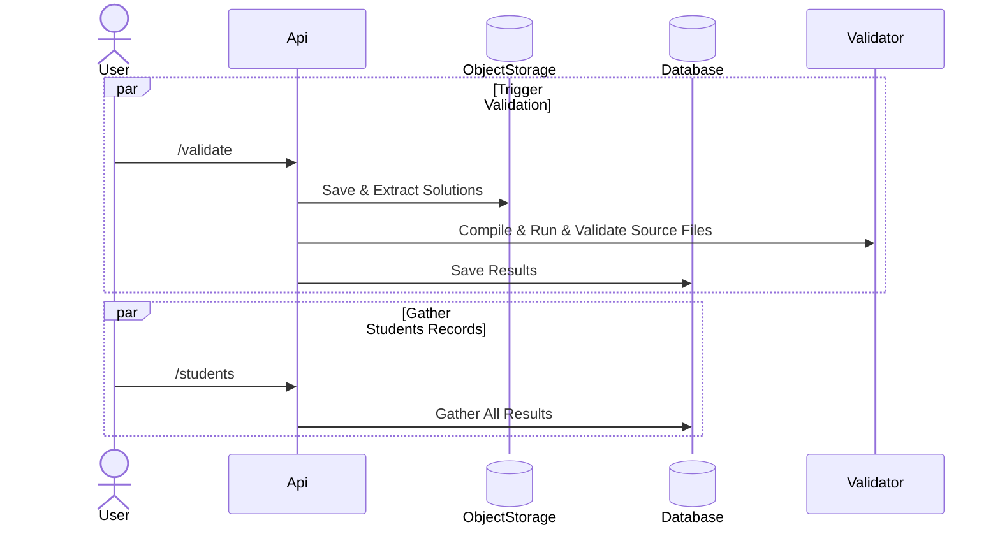

# System Sequence Diagram

## Source

```mermaid
sequenceDiagram

actor USER as User
participant API as Api
participant ObjectStorage@{ "type": "database" }
participant Database@{ "type": "database" }
participant Validator

par Trigger<br />Validation
    USER->>API : /validate
    API->>ObjectStorage : Save & Extract Solutions
    API->>Validator : Compile & Run & Validate Source Files
    API->>Database : Save Results
end
par Gather<br />Students Records
    USER->>API : /students
    API->>Database : Gather All Results
end
```
